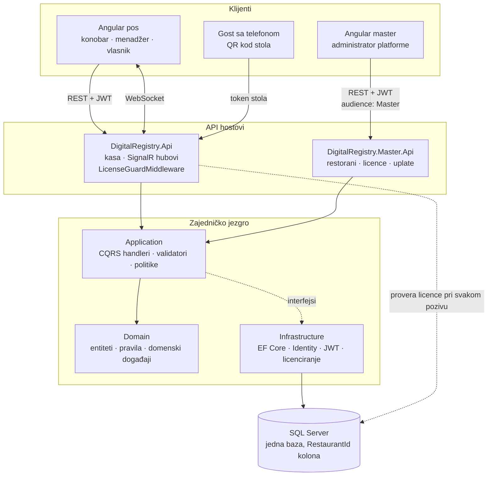
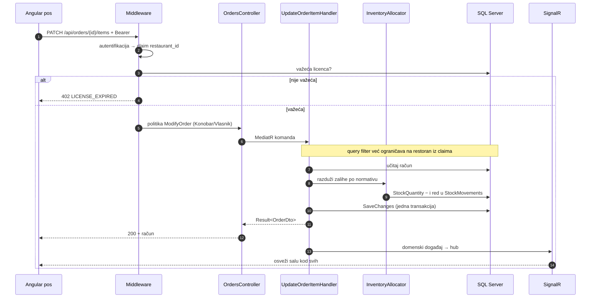
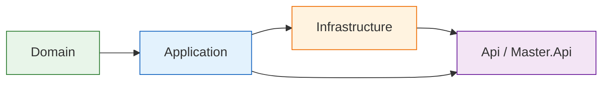
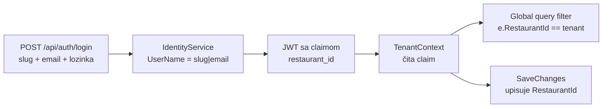

# Arhitektura

Dva API hosta nad istim domenom i istom bazom, i dve Angular aplikacije koje ih koriste. Podela nije
kozmetička: kasa radi unutar jednog restorana i sve što pročita prolazi kroz tenant filter, dok
master aplikacija radi **iznad** restorana i taj filter namerno zaobilazi.

## Celina

Strelica od `Application` ka `Infrastructure` je isprekidana jer ide obrnuto od zavisnosti: aplikacija
deklariše interfejse (`IDigitalRegistryDbContext`, `IIdentityService`, `ILicenseService`,
`ITenantContext`, `IInventoryAllocator`), a infrastruktura ih implementira i registruje pri
pokretanju. Zato domen i aplikacija ne znaju ni za EF Core ni za ASP.NET.

## Put jednog zahteva

Šta se dešava kad konobar doda pivo na račun:

Tri stvari koje ovaj put drži zajedno:

- **Licenca se proverava pre kontrolera**, ne u handleru, pa nijedan endpoint ne može da je zaboravi.
- **Zalihe i račun se snimaju u istom `SaveChanges`.** `InventoryAllocator` ništa ne snima sam —
  jedinicu posla drži pozivalac, pa promet i izmena računa ili prođu zajedno ili nikako.
- **Realtime je posledica, ne zamena za odgovor.** Klijent koji je poslao izmenu dobija je kroz HTTP;
  hub samo kaže ostalima da osveže.

## Slojevi i šta u kom sme

| Sloj | Sadrži | Ne sme da zna |
| :--- | :--- | :--- |
| Domain | entiteti, enumi, `Money`, domenska pravila i događaji | ništa spoljašnje — nema referenci |
| Application | komande, upiti, handleri, validatori, DTO-ovi, RBAC matrica | EF Core, ASP.NET, SQL |
| Infrastructure | `ApplicationDbContext`, Identity, JWT, SignalR, `LicenseService` | detalje pojedinačnih ekrana |
| Api / Master.Api | kontroleri, middleware, DI, konfiguracija | poslovna pravila |

`Api.Shared` drži ono što oba hosta koriste na isti način: baznu klasu kontrolera koja `Result<T>`
prevodi u statusni kod, obradu grešaka u RFC 7807 obliku, `CurrentUserService` i `TenantContext`.

## Odakle dolazi restoran

Vrednost uvek dolazi iz **potpisanog** tokena, nikad iz rute, zaglavlja ili tela zahteva — inače bi
menjanje jednog polja u zahtevu bilo dovoljno da se vidi tuđi restoran. Isti mehanizam pokriva i
gosta: token QR sesije nosi `restaurant_id` stola, pa anonimna porudžbina ne izlazi iz filtera.

Master API koristi **drugu `Jwt:Audience`**, pa token kase na njemu ne radi i obrnuto, a njegovi
handleri čitaju kroz `IgnoreQueryFilters()` — držano isključivo u `Features/Platform/`, da se
zaobilaženje filtera ne raširi po kodu.

## Provera u više slojeva

Jedna stvar se proverava na više mesta, i to namerno:

| Nivo | Šta hvata | Gde |
| :--- | :--- | :--- |
| Unit testovi | domenska pravila i handleri | `tests/*.UnitTests` — 182 testa |
| Integracioni testovi | rutiranje, RBAC, licencni zid, filteri, in-memory baza | `tests/DigitalRegistry.IntegrationTests` — 26 testova |
| Frontend testovi | interceptori, sesija stola, boje sale, validacija rezervacije | `Frontend/projects/**/*.spec.ts` — 43 testa (vitest) |
| Prolaz kroz API | svaka ruta oba hosta protiv SQL Servera | `tools/api-walkthrough/main.py` |
| Prolaz kroz bazu | šta je svaki endpoint zaista upisao | `tools/api-walkthrough/dbwalk.py` |

Poslednja dva postoje zato što in-memory provajder ne prevodi SQL i ne primenjuje ograničenja: dve
greške koje su ranije nađene (`SetRecipe` i dodavanje stavke na praćen račun) bile su nevidljive za
sve što ne priča sa pravim SQL Serverom, a jedna kasnija (dopuna zaliha bez reda u knjizi prometa)
bila je nevidljiva za sve što gleda samo statusni kod.
