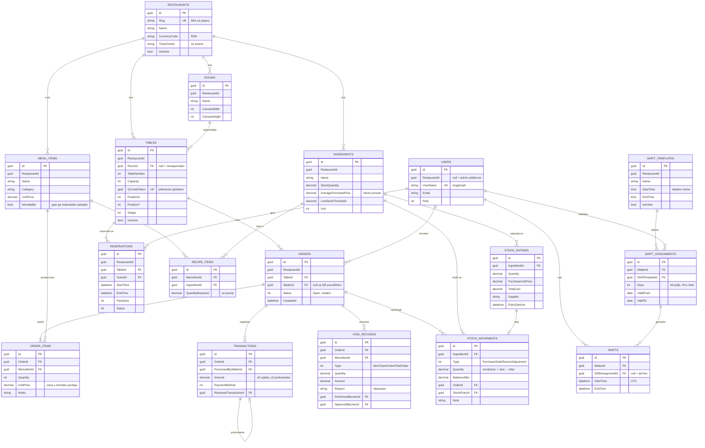
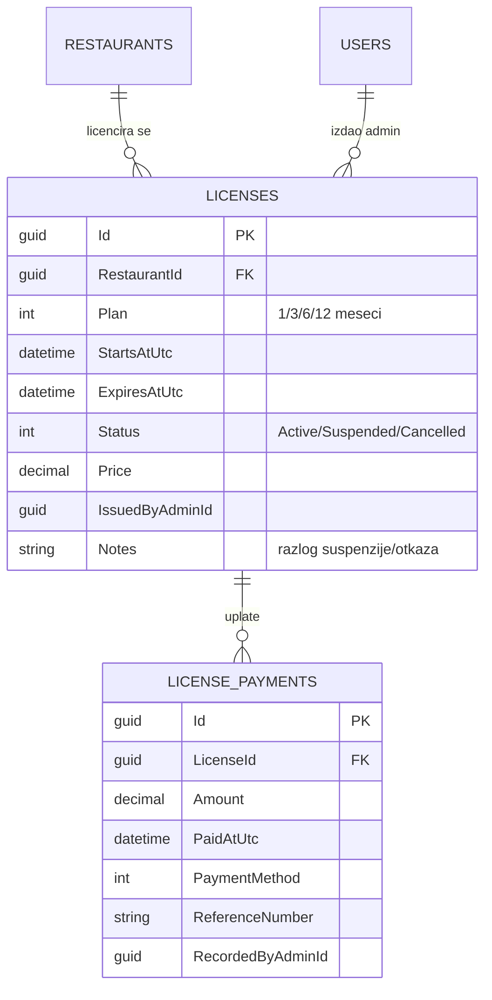

# Model podataka

Šema je izvedena iz domenskog modela EF Core migracijama; ovo je njen pregled. Dijagrami su Mermaid,
pa se renderuju na GitHubu, a za pisani deo se izvoze u sliku:

```powershell
mkdir docs/img
npx -y @mermaid-js/mermaid-cli -i docs/er-diagram.md   -o docs/img/er.png   -w 2400
npx -y @mermaid-js/mermaid-cli -i docs/architecture.md -o docs/img/arch.png -w 1600
```

Izlazni direktorijum mora da postoji, a alat pravi po jednu sliku za svaki dijagram u fajlu i
numeriše ih (`er-1.png`, `er-2.png` …).

## Kako se restorani razdvajaju

Sve u jednoj bazi. Svaka tabela koja pripada restoranu nosi kolonu `RestaurantId`, koju
`ApplicationDbContext` postavlja pri upisu i po kojoj EF Core global query filter odseca čitanje.
Presudno je da **filter nije stvar upita nego konteksta**: handler piše običan `context.Orders`, a
red tuđeg restorana ne postoji za njega.

Dve namerne posledice:

- `RestaurantId` na tim tabelama **nema strani ključ** ka `Restaurants`. Integritet drži filter i
  stampanje pri upisu, ne baza. Cena toga je da bi greška u kodu mogla da upiše red sa pogrešnim
  restoranom, a baza ne bi imala šta da kaže.
- `Table.QrCodeToken` je jedinstven **na nivou platforme**, a ne po restoranu: gost skenira kod pre
  nego što se zna o kom je restoranu reč, pa token mora sam da razreši restoran.

Prirodni ključevi koji se ponavljaju između restorana su jedinstveni tek u paru sa `RestaurantId`:
`Tables(RestaurantId, TableNumber)`, `MenuItems(RestaurantId, Name)`,
`Ingredients(RestaurantId, Name)`, `Rooms(RestaurantId, Name)`, `ShiftTemplates(RestaurantId, Name)`.

## Poslovni deo



## Platforma i licence

Ove tabele **nisu** tenant-scoped: master aplikacija ih vidi sve, a kasa ih dodiruje samo kroz
proveru licence.



Vrednost `LicensePlan` **je** broj meseci (`Monthly = 1`, `Quarterly = 3`, `SemiAnnual = 6`,
`Annual = 12`), pa je produženje `ExpiresAtUtc.AddMonths((int)plan)` i nema tabele preslikavanja.
Status važenja se **izvodi** iz `ExpiresAtUtc` u odnosu na sada — ne postoji noćni posao koji bi
licencu prebacio u „istekla", pa ne postoji ni prozor u kome bi zapis lagao.

## Pravila koja drži baza

Ograničenja nisu ukras — ona hvataju ono što bi promaklo grešci u kodu:

| Ograničenje | Šta sprečava |
| :--- | :--- |
| `CK_Transaction_Amount_Sign` | uplata mora biti ≥ 0, a protivstavka ≤ 0 |
| `IX_Transactions_OrderId` (filtriran, `ReversesTransactionId IS NULL`) | dve uplate na istom računu; protivstavka je namerno drugi red |
| `IX_Transactions_ReversesTransactionId` (filtriran) | dve protivstavke nad istom uplatom |
| `CK_StockMovement_Quantity_NonZero` | promet koji ništa ne pomera |
| `CK_Ingredient_Stock_NonNegative` | negativna zaliha |
| `CK_License_Period` | licenca koja ističe pre nego što počne |
| `CK_Reservation_Period`, `CK_Shift_Period` | period koji se završava pre početka |
| `CK_ShiftTemplate_Period` | šablon smene bez trajanja (`StartTime = EndTime`) |
| `CK_Table_Rotation_Range` | rotacija stola van 0–359° |

Brisanja: `OrderItems` i `RecipeItems` idu kaskadno sa roditeljem; `Tables.RoomId` i
`Shifts.ShiftAssignmentId` su `SET NULL` — sto preživi brisanje prostorije, a već generisana smena
preživi brisanje stalne dodele i samo prestane da tvrdi da pripada rasporedu. Sve ostalo je
`NO ACTION`, pa se istorija ne može tiho izgubiti.
